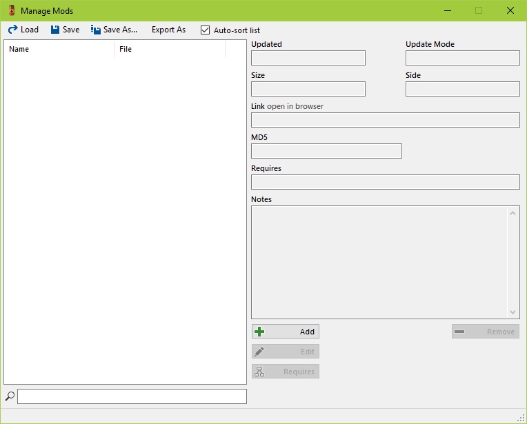

# Awesomesauce Modpack Tools Screenshots

## v1.0.0

#### Main Window

#### Manage Mod List

#### Add Mod

#### Edit Mod Requirements

#### Edit Mod Properties

#### Update Mod List

#### Download Mods

